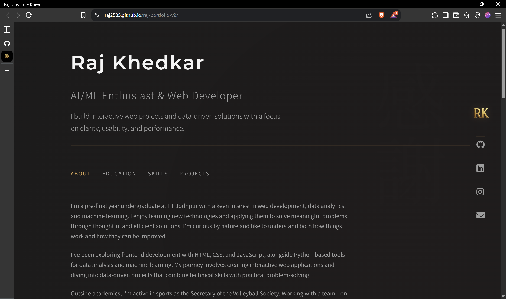

# Raj Khedkar – Portfolio v2

Welcome to the second version of my personal portfolio website.  
Built using HTML, CSS, and JavaScript, this site showcases my projects, experience, and interests in a clean, minimal layout—drawing inspiration from both Japanese aesthetics and Brittany Chiang's portfolio design.

Live Demo: [https://raj2585.github.io/raj-portfolio-v2](https://raj2585.github.io/raj-portfolio-v2)

---

## Features

- Responsive design for all screen sizes
- Minimal, Zen-inspired UI with subtle cultural touches
- Modular code structure
- Deployed via GitHub Pages

---

## What's New in v2

- Completely redesigned UI with Japanese aesthetic influences
- Improved responsive design
- Enhanced project showcase section
- Better performance and load times
- Modernized tech stack

---

## Prerequisites

- A modern web browser (Chrome, Firefox, Safari, or Edge)
- Git (for local development)
- Optional: VS Code with Live Server extension for development

---

## Browser Compatibility

This portfolio has been tested and works well on:
- Google Chrome (latest)
- Mozilla Firefox (latest)
- Safari (latest)
- Microsoft Edge (latest)

---

## Tech Stack

- HTML5  
- CSS3 (Flexbox/Grid)  
- JavaScript (Vanilla)

---

## Inspiration

This project is inspired by:
- The elegant and minimal design sensibilities of Japanese culture
- Brittany Chiang's personal portfolio
- A desire for a clean, functional personal website

---

## Folder Structure

```
raj-portfolio-v2/
├── index.html
├── style.css
├── script.js
├── assets/
│   └── images, icons, etc.
└── README.md
```

---

## Screenshots


*A preview of the portfolio homepage*

---

## Development

To contribute to this project:

1. Fork the repository
2. Create a new branch (`git checkout -b feature/improvement`)
3. Make your changes
4. Commit your changes (`git commit -am 'Add new feature'`)
5. Push to the branch (`git push origin feature/improvement`)
6. Create a Pull Request

---

## Installation

To run it locally:

```bash
git clone https://github.com/raj2585/raj-portfolio-v2.git
cd raj-portfolio-v2
open index.html  # or use Live Server
```

---

## Deployment

This site is deployed using GitHub Pages.  
Just push changes to the `main` branch and it goes live at:

https://raj2585.github.io/raj-portfolio-v2/

---

## Contact

Feel free to connect with me:

- LinkedIn: [https://www.linkedin.com/in/raj-khedkar/](https://www.linkedin.com/in/raj-khedkar/)
- Email: rajkhedkar2585@gmail.com
- Portfolio: [https://raj2585.github.io/raj-portfolio-v2](https://raj2585.github.io/raj-portfolio-v2)

---

## License

This project is open source and free to use under the MIT License.
